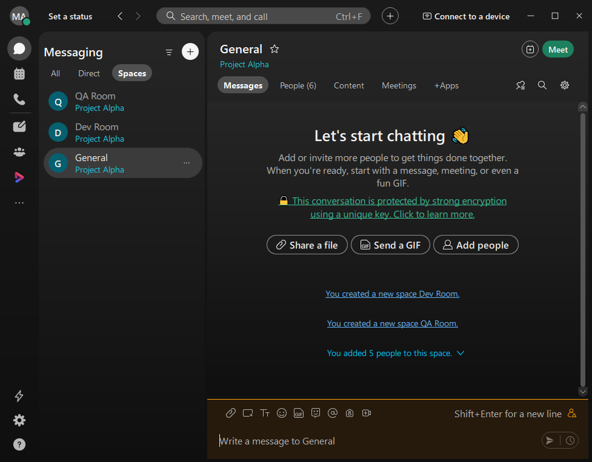

# Webex-API-Client

This minimalist project is designed to use the [Webex REST API](https://developer.webex.com/docs/basics) to enable automated interactions with the Webex collaboration platform. It provides a lightweight and focused interface that allows developers to programmatically create and manage rooms, send messages, manage memberships, schedule meetings, and retrieve user or organizational information without the overhead of a full-scale framework.

This project enables integration between your Webex workspace and external systems such as CI/CD pipelines, monitoring tools, and automation frameworks. By leveraging the Webex REST API, it can be used to send real-time status updates, error alerts, and completion notifications directly to Webex spaces or individual users.

A common use case is integrating with CI/CD pipelines to post structured updates at various stages of the workflow. For example, the project can automatically notify a designated Webex space when a build starts, a test suite completes, or a deployment finishes. In the event of a failure such as a test regression, linting error, or deployment rollback the system can post detailed error messages, logs, or even actionable links for debugging, thereby accelerating team response and collaboration.

## Webex Terminology

- **Rooms**

Rooms in Webex are persistent virtual spaces where individuals and teams can collaborate through messages, file sharing, and other interactive features. A room can serve a variety of use cases from informal discussions and announcements to project-based collaboration. Each room maintains its message history and context, making it easy for members to review past interactions. We can have `direct rooms` (between two users or `1:1`) or `group rooms` with multiple participants. Rooms are uniquely identified and can be programmatically created, updated, or deleted using the Webex REST API.

- **Room Memberships**

A room membership represents the association between a Webex user and a room. It defines who has access to the room and what level of interaction they are allowed. For example, a member may be granted moderator privileges, which allow them to manage other participants, lock the room, or delete messages. Memberships are crucial for access control and can be queried, created, or removed using API endpoints.

- **Teams**

Teams are organizational containers designed to group users around a common objective. A team consists of one or more rooms, which are visible to all members of the team. This structure supports better collaboration at scale, especially when working on projects that require multiple discussion threads (i.e., rooms) under a shared context. Teams can be created programmatically, and rooms can be added to or removed from teams as needed.

- **Team Memberships**

Team memberships link individual users to a team. A team member gains visibility into all rooms within that team (unless restricted by room-level settings). Just like room memberships, team memberships may also have roles like member or moderator, influencing what actions a person can take at the team level. Managing team memberships through the Webex API enables dynamic team composition and access control.

- **Groups**

Groups are collections of Webex users typically used for administrative or organizational purposes. Unlike teams, groups are not centered around collaboration in rooms but are used to apply policies, settings, and templates to multiple users at once. Groups are managed at the organizational level and can be integrated with directory services such as Active Directory or SCIM. They play a key role in identity management and policy enforcement.

- **People**

The term people in Webex refers to registered users within the platform. Each person has a unique user ID, email address, display name, and optionally other attributes like roles (e.g., admin or moderator). The People API allows querying users by various filters such as email or display name, making it easier to automate user discovery, provisioning, and role assignments.

- **Organization**

An organization in Webex is a logical container for managing users, settings, policies, and integrations. Each Webex user belongs to a single organization, which defines administrative boundaries and governs access controls. Organizations can also manage other organizations in multi-tenant or partner scenarios, particularly in enterprise or MSP (Managed Service Provider) use cases.

- **Meetings**

Meetings are real-time virtual conferencing sessions where users can collaborate via audio, video, chat, screen sharing, and whiteboarding. Unlike rooms (which are persistent), meetings are typically scheduled or started on demand and are time-bound. Webex meetings support features such as breakout rooms, co-hosting, end-to-end encryption, and participant registration. Meetings can be scheduled, listed, or joined using the Meetings API.

- **Recordings**

Recordings are digital archives of Webex meetings, including audio, video, shared content, and sometimes chat logs. Recordings can be automatically generated if enabled by the host and are stored securely in the Webex cloud. They can be retrieved, downloaded, or deleted via the Recordings API. These recordings are valuable for documentation, compliance, training, and review.

- **Messages**

Messages are the primary form of communication within rooms in Webex. Each message contains the sender's identity, a timestamp, and the message content (text, markdown, files, or attachments). Messages are persisted and can be retrieved, searched, or deleted using the Messages API. Developers can also post messages programmatically to trigger alerts, notifications, or bot responses.

## Getting Started

To begin using the Webex API, you must first create a Webex account. Authentication is performed using an `Authorization` HTTP header containing a valid access token. There are several types of tokens supported, including: Personal Access Token, Bot Access Token, OAuth Access Token, and Guest Issuer Token.

A personal access token is useful for development and testing purposes. This token allows API calls to be made on behalf of the user currently signed into the Webex Developer Portal. It is short-lived (valid for 12 hours) and should not be used in production applications. A production app should instead create an integration to obtain an access token from an authenticating user using OAuth.

Create an `.env` file in the project root and define the `WEBEX_API_TOKEN` environment variable to authenticate API requests. The [main.py](./main.py) script demonstrates a sample workflow that programmatically provisions a team named "Project Alpha" and adds five users as team members. It then creates two rooms ("Dev Room" and "QA Room") under the team. Three users are assigned to the Dev Room, while the remaining two users are added to the QA Room. Finally, a welcome message is posted to each room. This setup illustrates how to manage teams, rooms, memberships, and message delivery using the Webex API in a structured and automated manner.

